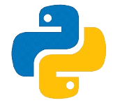
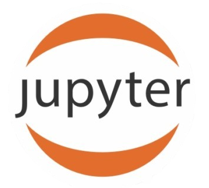
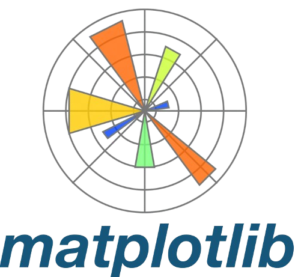
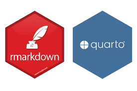
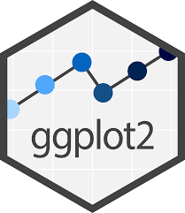

# [**Introduction**]{.blue}

Welcome to the [**Data Analysis II Course**!]{.blue}

[**Data Analysis II**]{.blue} builds on foundational concepts from `Data Analysis I`, focusing on advanced statistical modeling, machine learning techniques, and big data tools. Students will develop proficiency in predictive analytics through hands-on projects using `Python`, `SQL`, and distributed computing frameworks. The course emphasizes ethical considerations in modern data workflows and prepares students for real-world analytical challenges.

-------------

📋 [**Course Highlights:**]{.blue}

- [**Advanced Data Wrangling:**]{.light-blue} Implement advanced data wrangling techniques for complex, multi-source datasets.
- [**Advanced Visualization & Simulation:**]{.light-blue} Master complex data visualizations (Seaborn, plotly...) and probabilistic simulation exercises.
- [**Predictive & Statistical Modeling:**]{.light-blue} Build, interpret, and diagnose models including Multiple Regression, Generalized Linear Models (GLMs), Time Series (**ARIMA**), and Classification algorithms (**kNN**, **SVM**...).
- [**Dimensionality Reduction & Resampling:**]{.light-blue} Apply **PCA**, **t-SNE**, bootstrapping, and resampling methods to optimize model performance.
- [**SQL & Big Data Frameworks:**]{.light-blue} Execute complex `SQL` queries and big data operations using frameworks like `PySpark` and `Dask`.
- [**Ethics in Advanced Analytics:**]{.light-blue} Evaluate ethical implications in modern analytical workflows using GDPR and bias frameworks.

By the end of this course, you will have a deep mastery of advanced predictive analytics, empowering you to execute complex data science workflows and make data-driven decisions.

--------------

# [**Course Criteria**]{.blue}

| **`Criteria`** | **`Percentage`** |
|:---------|:----------:|
|In-class activities & quiz| 15% |
|Labs | 25% |
|Midterm Exam| 30% |
|Final Project & Presentation / Practical labs| 30% |

## [**Programming:**]{.blue}

> You are free you use your favorite programming language [{width=30px style="position: relative; bottom: 0px"}](https://www.python.org/){target="_blank"} `Python` or [{width=30px style="position: relative; bottom: 0px"}](https://www.r-project.org/){target="_blank"} .

::: {.panel-tabset}
## `Python`

- [{width=30px style="position: relative; bottom: 0px"} Jupyter Notebook](https://docs.jupyter.org/en/latest/){target="_blank"} 
- [{width=30px style="position: relative; bottom: 0px"} Google colab](https://colab.research.google.com/){target="_blank"}
- [{width=35px style="position: relative; bottom: 0px"} Matplotlib](https://matplotlib.org/){target="_blank"}
- [{width=30px style="position: relative; bottom: 0px"} Seaborn](https://seaborn.pydata.org/){target="_blank"}

## `R`

- [{width=60px style="position: relative; bottom: 0px"} Rmarkdown/Quarto](https://quarto.org/){target="_blank"}
- [{width=25px style="position: relative; bottom: 0px"} Posit cloud](https://ggplot2.tidyverse.org/){target="_blank"}
- [{width=27px style="position: relative; bottom: 0px"} Ggplot2](https://ggplot2.tidyverse.org/){target="_blank"}
- [{width=30px style="position: relative; bottom: 0px"} Tidyverse](https://www.tidyverse.org/){target="_blank"}

:::

-----------

# [**Course progress**]{.blue}

> Visit the course webpage for the progress: [Data Analysis II](https://hassothea.github.io/Data_Analysis_AUPP).

# [**Midterms, Exams and Projects**]{.blue}

In this section, you will find all the information related to the midterms, exams and projects including instructions, starting dates and the deadlines.

## [**Midterm & Exam**]{.blue}

- [**Midterm Exam**]{.light-blue}: Check Canvas for schedule.
- [**Final Exam**]{.light-blue}: Check Canvas for schedule.

## [**Project & Capstone:**]{.blue}

- Deadline for the report: Check Canvas.
- Where to submit: `Canvas`
- Your report should be in **PDF** format (prepared using Overleaf or Quarto/RMarkdown) and include the following criteria:
  - **Members' names & contributions**:
    - Clearly state each member's contribution to the project and report.
  - **Introduction & Purpose**:
    - Clearly state the objectives and analytical scope for multi-source datasets.
  - **Advanced Wrangling & Preprocessing**:
    - Detail steps to clean, transform, and handle complex datasets, missing values, and outliers.
  - **Exploratory Data Analysis & Visualization**:
    - Include advanced visualizations (ggplot2/Seaborn) and statistical diagnostics.
  - **Model Development & Resampling**:
    - Explain choice of advanced models (GLM, ARIMA, Classification, PCA).
    - Provide details on validation, bootstrapping, and model optimization steps.
  - **Results, Evaluation & Ethics**:
    - Present model performance metrics.
    - Evaluate ethical implications, privacy frameworks (GDPR), or potential algorithmic bias.
  - **Conclusion & References**:
    - Summarize key insights and future work.
    - Cite all sources and tools in APA format.
- **Presentation**: 
  - Capstone presentations will take place during Sessions 29 and 30.

------------

# [**Resources and Further Reading**]{.blue}

Here, you will find additional resources, including books, research papers, and online courses, to further your understanding of **Data Analysis**.

📚 You will find these books/links helpful...

- [A General Introduction to Data Analytics, Moreira et al. 2019](https://content.e-bookshelf.de/media/reading/L-11307411-11b3dd5f67.pdf){target="_blank"}

- [Data Sience for Business, Foster Provost & Tom Fawcett](https://www.advisory21.com.mt/wp-content/uploads/2023/05/Data-Science-for-Business.pdf){target="_blank"}

- [Exploratory-Data-Analysis-with-Python-Cookbook](https://github.com/PacktPublishing/Exploratory-Data-Analysis-with-Python-Cookbook?tab=readme-ov-file){target="_blank"}

- [Handbook of Data Visualization, Chen et al.](https://haralick.org/DV/Handbook_of_Data_Visualization.pdf){target="_blank"}

- [Python for Data Analysis, Wes M.](https://wesmckinney.com/book/){target="_blank"}

- [Exploratory Data Analysis with R, Roger D. Peng](https://bookdown.org/rdpeng/exdata/){target="_blank"}

- [R for Data Science, Hadley W. and Garrett G.](https://batrachos.com/sites/default/files/pictures/Books/Wickham_Grolemund_2017_R%20for%20Data%20Science.pdf){target="_blank"}

------
